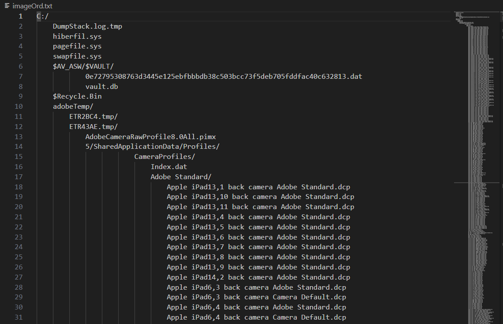

# FileTreeExplorer

FileTreeExplorer est un script Python qui parcourt récursivement un répertoire et enregistre la structure des fichiers et dossiers dans un fichier texte avec une hiérarchie d'indentation pour chaque niveau de sous-dossier. Par défaut, il commence avec le répertoire "C:/", mais peut être adapté à d'autres chemins.

## Fonctionnalités

- **Exploration Récursive** : Parcourt tous les sous-dossiers et fichiers d'un répertoire donné.
- **Écriture Hiérarchique** : Les fichiers et dossiers sont listés dans un fichier texte avec une indentation correspondant à leur niveau de profondeur dans l'arborescence des répertoires.
- **Gestion d'Erreurs** : Gère les exceptions lors de l'accès à certains répertoires non autorisés ou inexistants.
- **Personnalisable** : Vous pouvez adapter le chemin de départ en fonction de vos besoins.
##Exemple

